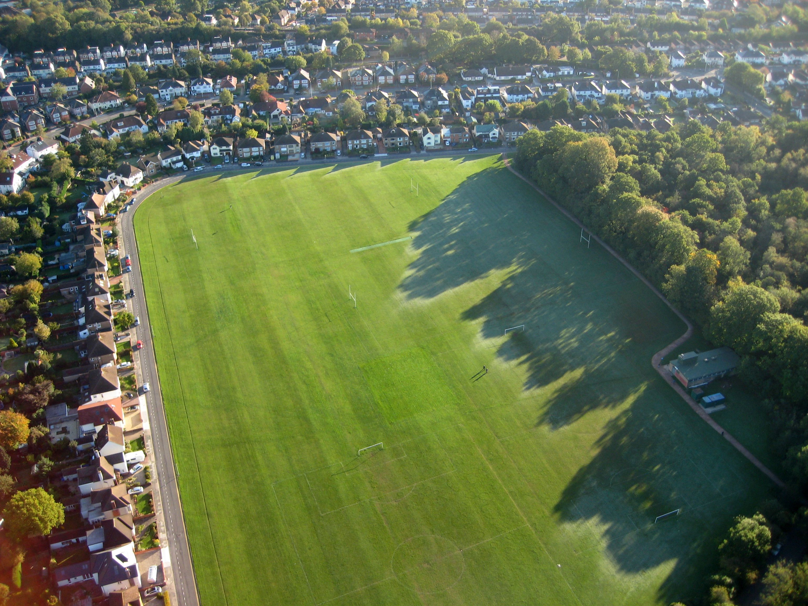
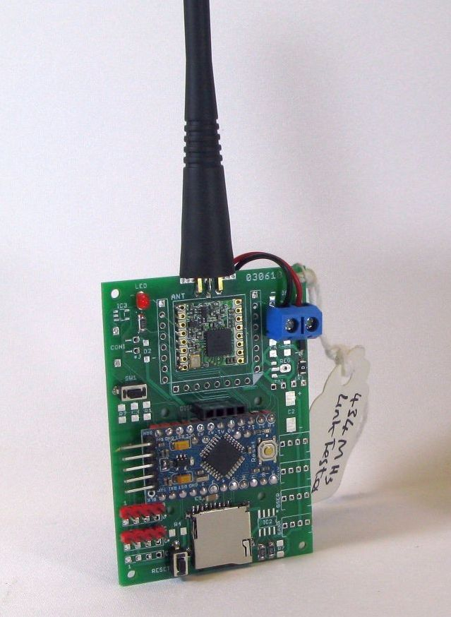
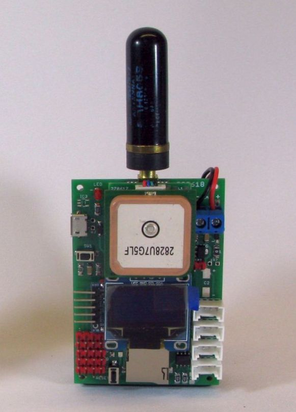
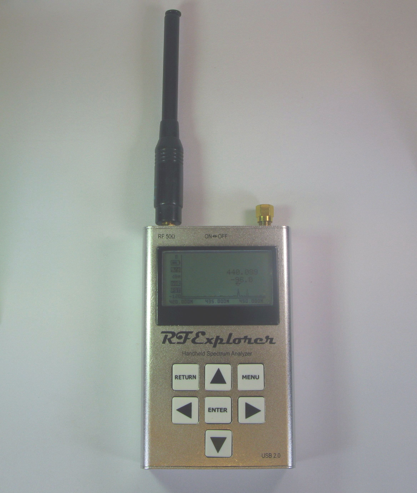
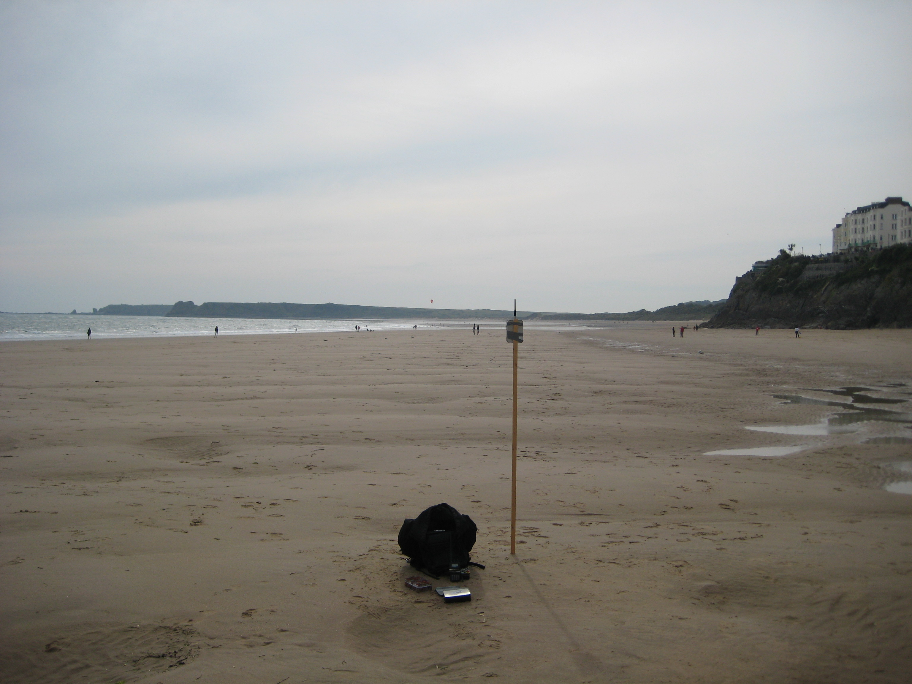
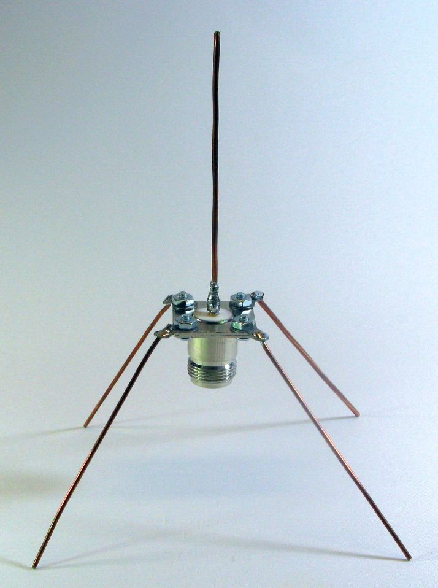
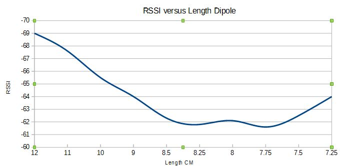

## Testing antennas is easy.

Really it is. 

The prime objective of an antenna is to radiate the maximum amount of power in the direction of choice. A secondary objective is to match the transmitter output impedance to the antenna so that minimum power is reflected back into the transmitter as excess reflected power can damage a transmitter.

For our low power, typically less than 100mW, Internet of Things devices, in order to maximise range (distance) we normally concentrate on maximising radiated power rather than obsessing about antenna matching. We still do however, need to be confident that a reasonable antenna is attached, even low power LoRa devices can be damaged if they transmit with no antenna or one that is defective. 

There is great deal of theory to understand about antennas, many sophisticated and complex charts you can draw and some very capable computer simulation tools. You can write many thousands of words describing how good an antenna is. There are fancy antenna gizmo's that allow precise measurements of an antenna's standing wave ratio (SWR) and measurements of the resonant frequency of the antenna. The stark truth however is that none of this sophistication and time spent tells you how the antenna actually performs in the real world. 

It often seems not to be appreciated that theoretical analysis and SWR type measurements do not tell you how the antenna will perform in reality, I have seen a great many forum posts and professional presentations with charts, simulations and tests with fancy antenna gizmos and similar. But ask the question 'what is the real world performance of the antenna ?' and very often you don't get a convincing answer, maybe its just me being picky though.

I have a fancy antenna gizmo (VNA - vector network analyser) and it's great for setting up or fine tuning an antenna, but apart from that bit of technology I don't bother with charts or simulations, I just check the actual performance, its what I really want to know after all. And you don't need a VNA to tune an antenna either. 

It should be understood that absolute measurements of antenna performance are a challenge. It can be difficult and time consuming to measure the actual gain of an antenna in every direction. However apart from potential dodgy sellers on eBay and Aliexpress, 99.99999% of the time we do not need to know the absolute performance on an antenna, we just need to know the comparative performance between different antennas, which one in best, and how much better is one than another or in relation to a reference. It's this comparison that is really very easy. When setting up our tests we just need to make sure that the only variable or thing that changes in the tests is the antennas themselves. If the transmitter, receiver, location, height and orientation of the components used during a test stay the same, then a difference in test results should be due to the differences in the antennas.

For most IOT type applications we want the transmitter to radiate maximum power in a horizontal direction out to the horizon more or less parallel with the ground. It's true that if a transmit antenna is on a tall building and the receive antenna is close in at ground level then the path from transmitter to receiver is pointing steeply downwards and not parallel to the ground. However the receiver is normally very close to the transmitter so that fact that the antenna may actually be radiating parallel to the ground does not cause issues. As the receiver gets a long distance from the transmitter, then the path between them will be close to parallel to the ground. 

Thus to measure an antenna's performance we can simulate (or be very close to) the real world situation in a large flat open area. A large playing field is good, as long as you are maybe 100m or so from trees or buildings which could affect our tests. I use a local playing field, see the picture below. 

So we have an antenna to test, what next ? 

We need a transmitter and it's antenna to radiate a signal on the chosen frequency. Fortunately the low cost Semtech SX127x based LoRa modules can do just this, they can transmit a radio frequency carrier at a chosen frequency at a power level of between 2dBm and 20dBm. See below for a basic Arduino transmitter. It's a simple PCB with LoRa module, Arduino Pro Mini and a battery pack can be fixed to the rear;

The board can be fitted with a RFM9x LoRa module and has single Mikrobus socket. There are options for I\O and Grove connectors, MicroSD card and a low quiescent current regulator. The boards can be bought in pairs from [http://www.LoRaTracker.uk](http://www.LoRaTracker.uk "http://www.LoRaTracker.uk"), but any 3.3V Arduino will do with the appropriate connections.   

The **Transmitter** program (I call it the Ping Tone Transmitter) is \_Tone\_Transmitter.ino. It sends out a burst of tone carrier at the set frequency for approximately 3 seconds with a time gap in between. If the transmitted frequency is in the 434Mhz region we can listen for it on a UHF hand-held, or a low cost software defined radio attached to a PC\Laptop, the carrier is in effect and FM transmitted tone.

The frequency (in hertz) of the transmission is set by this line in the "Settings.h" file;

const unsigned long Frequency = 434400000;        //frequency of transmission

There are also settings for a calibration offset, to compensate for any frequency error of a particular module (normally you can leave it at zero). You can set the transmit power in dBm and some other parameters for the tone transmitted. At program start-up the LoRa module is checked, if it's not found the LED will flash very rapidly. When the tone is actually being transmitted the LED is on. 

Next we need a way of measuring the signal strength some distance away from the transmitter. We can also do this with a LoRa module, see below the same PCB as above with a display added so we can see the received signal strength;

The RSSI meter program can be used by reading the serial monitor output on a PC but it's far more convenient to use one of the display options for a hand-held portable device, with either an SSD1306 OLED display or a 20x4 3.3V LCD display run via a low cost PCF8574 I2C expander.

A more conventional way of reading signal strength may be with a spectrum analyser, either bench type or portable. The portable type is a lot more convenient to use out of doors, see the RF Explorer below for an example;

There is also the option of using a Realtek SDR (software defined radio)  dongle with a PC or Android phone\tablet, but it can be difficult to get precise RSSI readings.

### Loading the Programs

There are two Arduino programs to load, first the ping tone transmitter;
##### Ping\_Tone\_Transmitter.ino

And a matching RSSI meter;

##### RSSI\_Tone\_Meter\_SSD1306.ino

For an Arduino with an SSD1306 OLED display.

##### RSSI\_Tone\_Meter\_LCD.ino

For an Arduino with an 20x4 LCD display and PCF8574 I2C adapter. 

These programs are found in the \programs directory of this repository. The programs were tested with version 1.8.5 of the Arduino IDE. The transmitter and receiver were both powered by Arduino Pro Minis, 3.3V and 8Mhz. The use of 3.3V Pro Mini avoids the need for logic level translation on the LoRa device.  

The receivers are set to the same frequency as the Ping tone transmitter. The receiver then uses the RSSI function of the LoRa device to read the received signal and averages the readings for display. 

The transmitter and receiver (with antennas attached) can be simply taped to a thick bamboo pole and pushed in the ground, maybe 50M apart. Here is a test transmitter in a metal box on another antenna testing range I have used, Tenby beach in South Wales.

Alternatively it's easy to make a tall tripod from three thick bamboo poles and hang the transmitter and antenna from the middle see picture;

In the above picture I was testing the de-tuning affect of a plastic pipe on the antenna. The actual transmitter, a small tracker PCB and battery is hanging off the bottom of the antenna's SMA connector.

You should use wood\bamboo poles as we don't want any metal nearby to affect our antennas. 

At this point we are set-up to measure the output power from the transmitter and it's antenna, but what does the measurement we are seeing, say an RSSI reading of -60dBm, actually mean ? 

If we had a reference antenna, which we will call antenna A, we could swap antennas on the transmitter and compare the reference with our antenna of interest which we call antenna B. Swapping antennas is quick so the comparison is quick too. 

For a reference antenna (A), build a 1/4 wave vertical with radials, see picture, this is an 868Mhz antenna, its built on a N-type chassis socket. 

This antenna is easy to build and difficult to get wrong. If the length of the centre vertical and downward pointing radials are all 1/4 wave at the frequency of interest, then the performance should be predictable and it can act as our reference. 

The process is now that we first measure the RSSI of our reference antenna (A) at a fixed reference point, say 50M from the transmitter. Assume the  the result is -60dBm average at the remote receiver at the fixed reference point. If we swap antennas and the measurement (at the fixed reference point) for B is now -57dBm then we know that antenna B has 3dBm gain over antenna A (our reference). 

The reference antenna should in practice have a gain close to 2dBi, so if the B antenna is 3dBm better it ought to be a 5dBi antenna. 

If we have a range of different antennas, say C, D and maybe E, it's the work of a couple of minutes to test their comparative performance.

Once we have this simple antenna testing range set-up, we can use it to trim or tune antennas too. For instance if we build a reference antenna type (see above) we can build it with wires that are say 50% longer than a 1/4 calculation calculation suggests. Then with a suitable assistant (or a lot of walking) we can trim short bits off the antenna wires and measure the effect with our receiver. Record the results, plot a graph and it can look like this, it shows the effect on radiated power as a 868Mhz dipole is trimmed to length;

Note that maximum radiated power occurs at around 7.75cm. This is different to the length that calculations for a 868Mhz dipole suggest, which is 8.68cm. At the so called 'correct' length the antenna actually radiates about 1.5dBm less than the optimum length, so there is an improvement gained of 1.5dBm in performance by carrying out a real world tuning test. 

The LoRa modules do vary slightly in their output impedance, see the result of tuning dipoles of 3 separate LoRa modules;

Note that each module has a slightly different optimum length, but all are shorter than what a theoretical calculation suggests (8.68cm). 

### A cautionary tale

If there are still sceptics of the benefit of practical testing, a cautionary tale. 

I had built a 868Mhz co-linear antenna based on plans where the design had been professionally modelled for optimum performance. After a bit of adjustment it peaked dead on 868Mhz and had a SWR less than 1.1, all this measured with a fancy antenna tuning gizmo. The real world performance however was dreadful, the antenna emitted some **3dBm less** than a simple 1/4 wave with radials although modelling had suggested it should be 3dBm more. This is the point really, fancy antenna gizmos cannot tell you how an antenna performs for real .......................... 

### Stuart Robinson

### www.LoRaTracker.uk

     